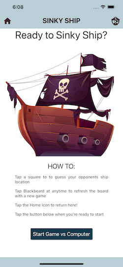

# Sinky Ship v3 - React Native
Sinky Ship v3 is a React Native strategy game where the goal is to sinky the computer players ship.

# Vision
* What is the vision of this product? A React Native mobile game that allows a user to play a game of sinky ship against a computer opponent. The game will be interactive through a mobile device and work with randomly generated sinky ships.

* What pain point does this project solve? Allows for a novel way to enjoy your free time.

* Why should we care about your product? Takes a classic game and makes it more enjoyable and dynamic.

# User Stories

* As a user I would like to be able to interact with the game and have it be visually appealing because I would find it more engaging

* As a user I want the application to be able to notify the server of my movements and send me the output after my opponent has moved and vice versa so that I can play the game

* As a player I want the computer to be able to prove a worthy adversary because that will be more fun

* As a user I want to be able to download the application as an mobile application because it will be more engaging

* As a user I would like to play against a computer opponent that is better than just choosing random selections and is harder to play against because it uses an algorithm for selecting targets

# Developers

* Carly Dekock

* Jason Quaglia

* William Moreno

* Jason Dormier

# Screen Shots

# Process Images

### DOM

### Schematic

### Wire Frame

### Color Pallete

# Resources

[Ship-Logo](https://www.freepik.com/vectors/travel) - Travel vector created by upklyak - www.freepik.com

[React-Native](https://reactnative.dev/docs/getting-started)

[React-Native-Elements](https://reactnativeelements.com/)

[React-Router](https://reactrouter.com/native/guides/quick-start)

[React-Native-Super-Grid](https://www.npmjs.com/package/react-native-super-grid)

[Expo](https://docs.expo.io/versions/latest/sdk/speech/)

[Medium](https://rossbulat.medium.com/react-hooks-managing-web-sockets-with-useeffect-and-usestate-2dfc30eeceec)

[Socket.io](https://socket.io/docs/v4/index.html)

# Credits

* Sara Russert

* Chance Harmon

* Chris Bortel

* Kory Jackson

* Kristian Esvelt

* Jacob Knaack
